[[TOC]]

# Basic Native API Integration for Webex and Slack

This method is the easiest to set up, as it does not require any coding nor servers or serverless applications to work. It is also the simplest and least customizable. This type of integration is not currently compatible with MS Teams, as the Meraki Dashboard only sends Webhooks in customized format to Webex and Slack.

## Webex Configuration

If you do not have a Webex developer account, go ahead and create one [here](https://developer.webex.com/). Also, download your Webex app [here](https://www.webex.com/downloads.html).

Open your Webex App, and create a new Space, that you can call "Meraki Alerts" or similar by clicking the “+” sign in the top bar. Add yourself to the space by typing your Webex email address in the “Add people by name or emai” box.

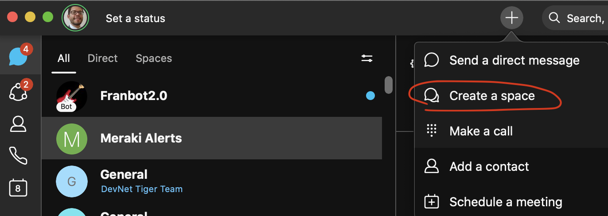

Go to Webex App Hub, and find the [Incoming Webhooks](https://apphub.webex.com/messaging/applications/incoming-webhooks-cisco-systems-38054) integration.

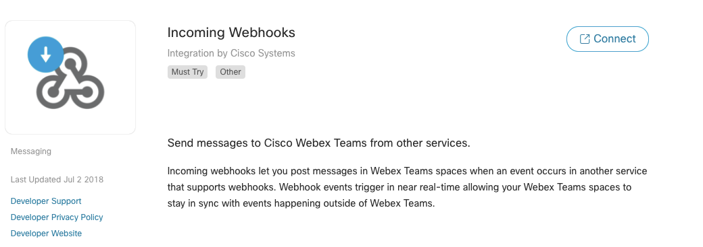

Click Connect, and give your Incoming Webhook a name, and associate it with the space you created in the previous step.

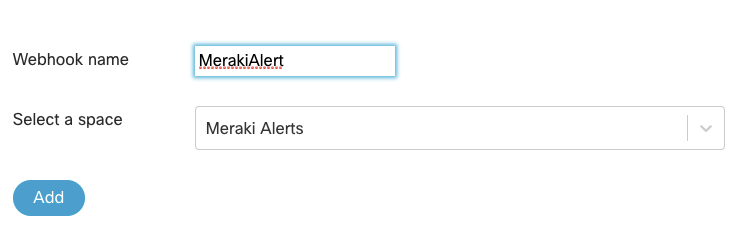

Copy the Webhook URL for later use.

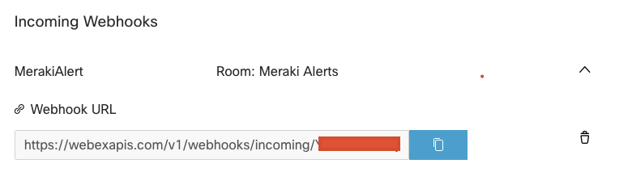

You can quickly test your integration by sending a POST message to the URL with the following format:

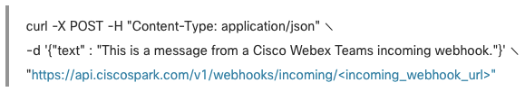

## Slack Configuration

Create a new Slack account by heading [here](https://slack.com/signin) and create a new Slack [workspace](https://slack.com/create). Then, download the [Slack app](https://slack.com/help/articles/207677868-Download-Slack-for-Mac) and sign in to your workspace.

Follow the guide [here](https://api.slack.com/messaging/webhooks) to create a new Slack App and enable incoming Webhooks for it.

Copy your Incoming Webhook URL for later use. You may quickly test it by sending a POST message to it in the following format:

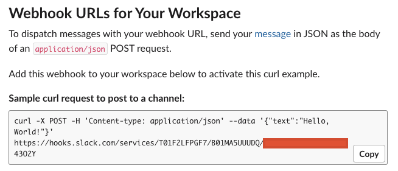

## Meraki Dashboard Configuration

NOTE: You need the **has_beta_api** NFO enabled for this section to work. 

Go to Network-wide, Alerts:

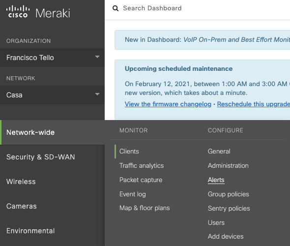

Scroll down to the Webhooks section, and add your Slack and Webex URLs, and select the appropriate Webhook payload template for each of your two Webhook URLs:

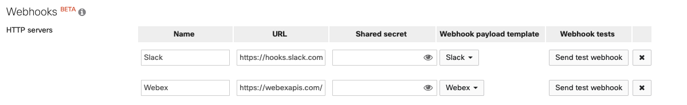

You can use the "Send test webhook" option to verify everything is working properly.

Now, you need to add these Webhook destinations to some of your alerts. If you want, you can add them as Default Alert Recipients at the top of your Alert Settings page if you want alerts for all other conditions you have configured enabled, however in this guide we will concentrate in two types of alerts: Sensor Alerts and Motion Recap Alerts.

Go to Environmental - Overview and select Alert Profiles.

If you haven’t, create a new Alert Profile for Open Doors and add your Webhooks as Recipients for it:

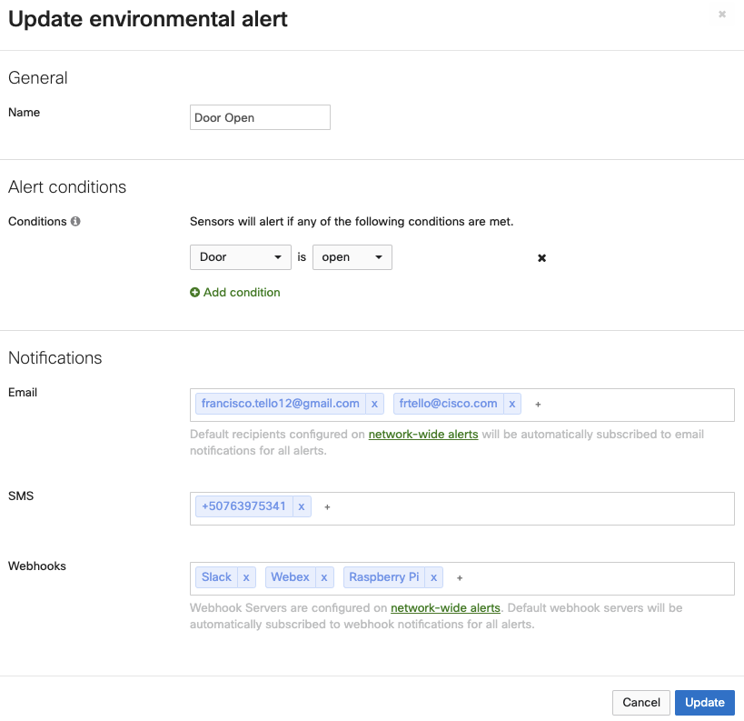

You may click the Test button in your Alert Profile to check everything is working properly, and you should receive alerts like these in your Slack and Webex clients:

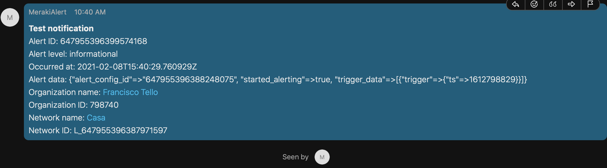

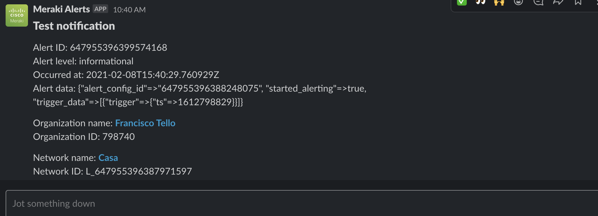

Go to your Sensors list and attach the Door Open profile to your MT20s by selecting them, clicking on More Actions and then Manage alert profiles:

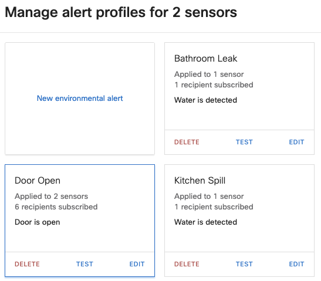

Next, go to Cameras and for each camera overlooking one of your MT20s, set up some Motion Alerts. Make sure your camera has clear view of the door that will be opened and closed and that few obstacles if any are in place that could obscure the face or features of the person opening and closing those doors.

Go to Settings - Motion Alerts, and define an Alerting schedule (mine are set to Always) and play around with the sensitivity of the Alert. I recommend starting at 1 second duration and 100% sensitivity, and test, test, test.

Keep in mind that:

* If you set sensitivity to 95% and there is motion in 3% of your area of interest you **won’t receive alerts**

* If you set sensitivity to 95% and there is motion in 5% or more of your area of interest you **will receive alerts**

**Enable Motion Recap** image within alert.

Define an Area of Interest enclosing the door which you will be monitoring, and optionally enable alerts only on people detection (I’m leaving this disabled).

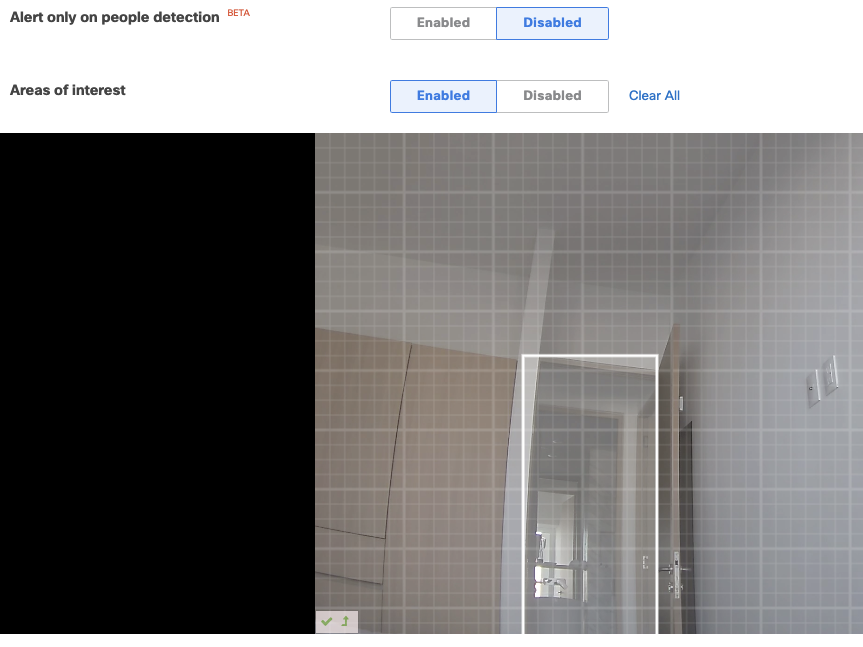

Save your config and repeat for any other cameras overlooking MT20s.

Go back to Alerts and make sure your Custom recipients for motion alerts are set to your Webhooks.

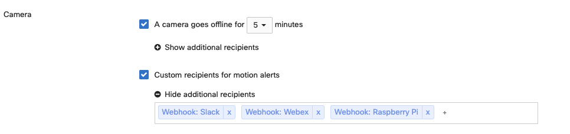

NOTE: If you selected your Webhooks as global Default recipients, you do not need to do this.

Now go ahead and start testing your setup by walking in front of the camera and opening and closing your door. You should start seeing messages like these in your Webex and Slack clients:

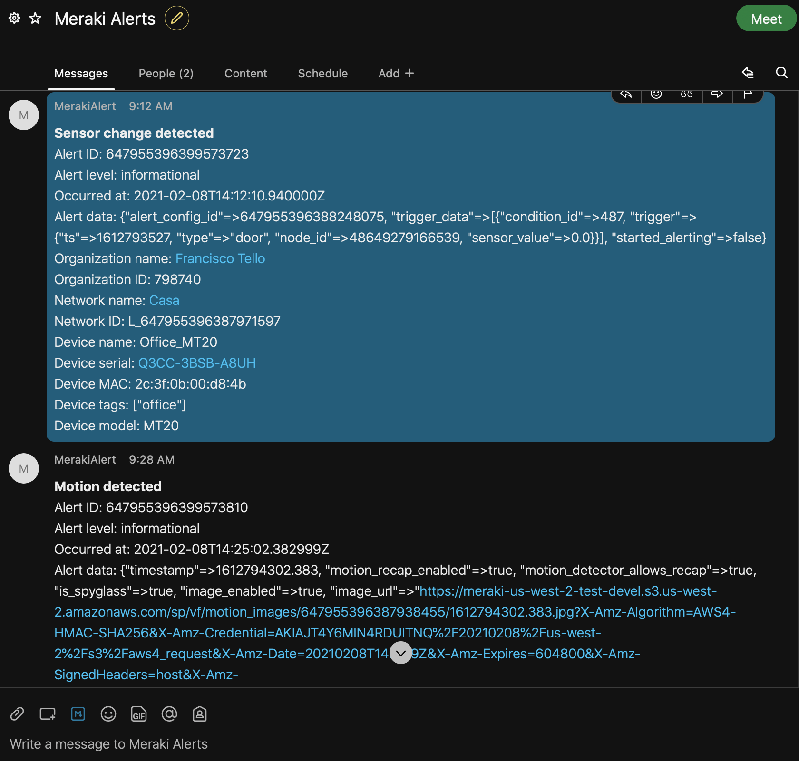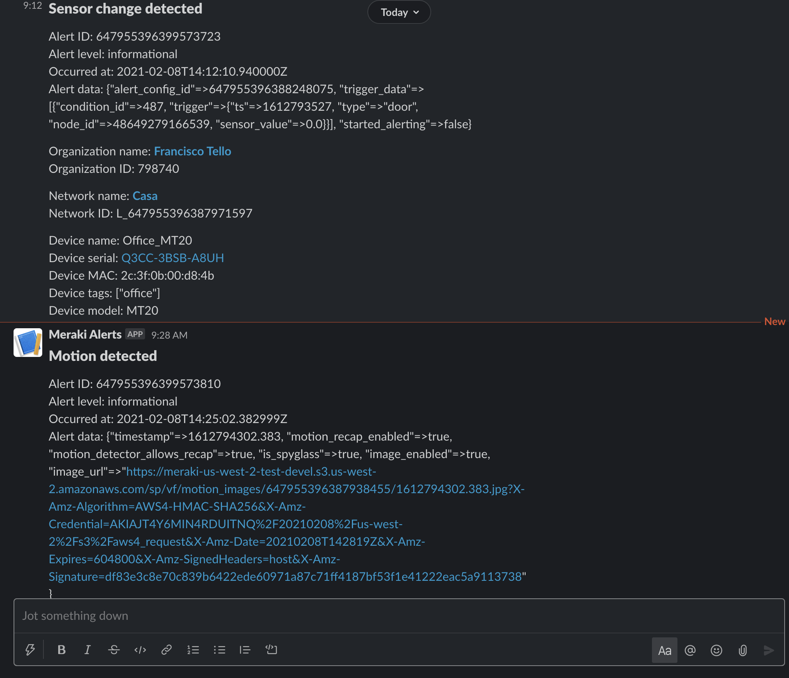

You can follow the link to the Image Url in your **Motion detected** alert to see the motion recap event that triggered the alert and who opened the door.

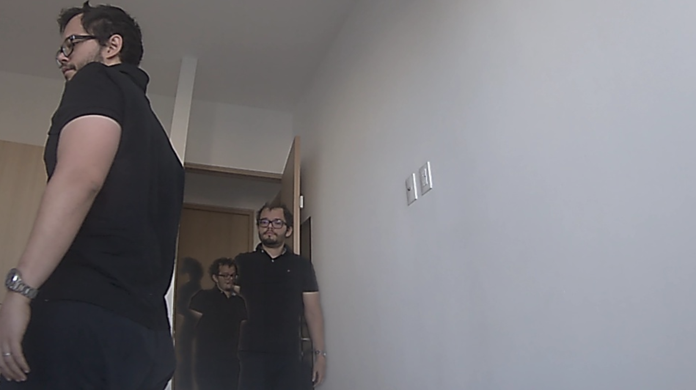

# Webex, MS Teams and Slack MT Alerts with Camera Snapshots

If you want to produce an easier to read output for your environment, you can use a more customized integration between the Meraki Dashboard and Webex, Slack or MS Teams. This integration is somewhat more complex, and it does require the use of either a dedicated server for listening to Webhooks, or the use of a Serverless application like [AWS Lambda](https://aws.amazon.com/lambda/), [Azure Functions](https://azure.microsoft.com/en-us/services/functions/) or [Google Cloud Functions](https://cloud.google.com/functions). In this tutorial, I’m using a Raspberry Pi 4 on premises with a Python Flask web server to listen to my Webhooks and transform and send the messages, but this should be fairly easy to adapt to the aforementioned serverless applications.

With this integration, you will be able to produce notifications for Webex, Slack and MS Teams like in the following examples:

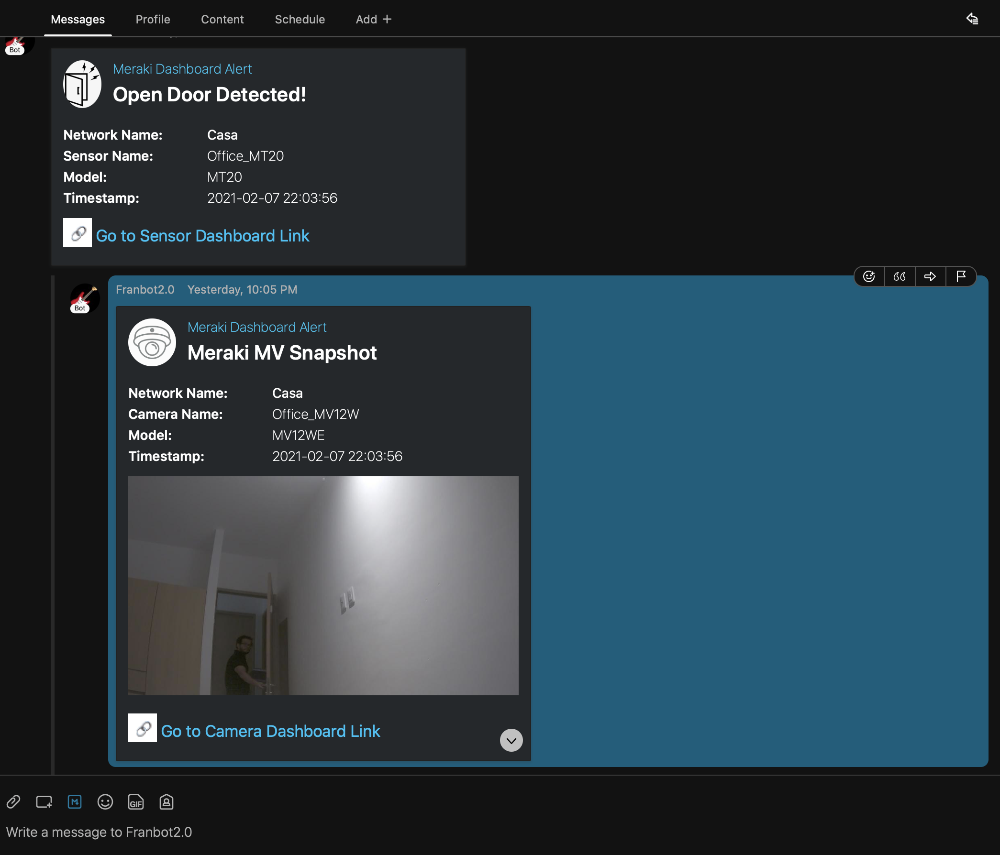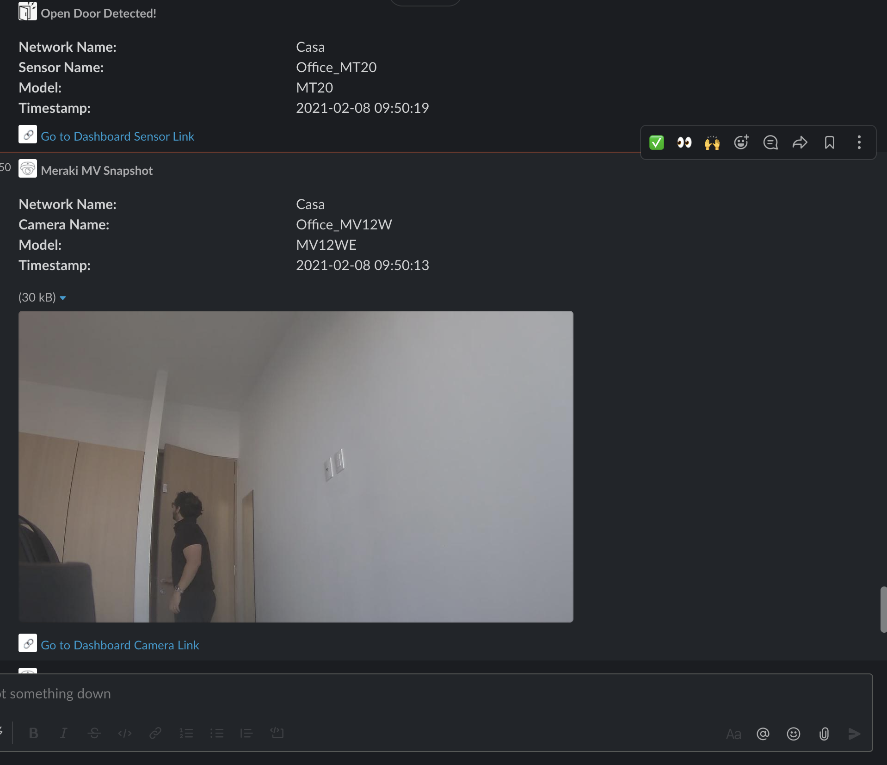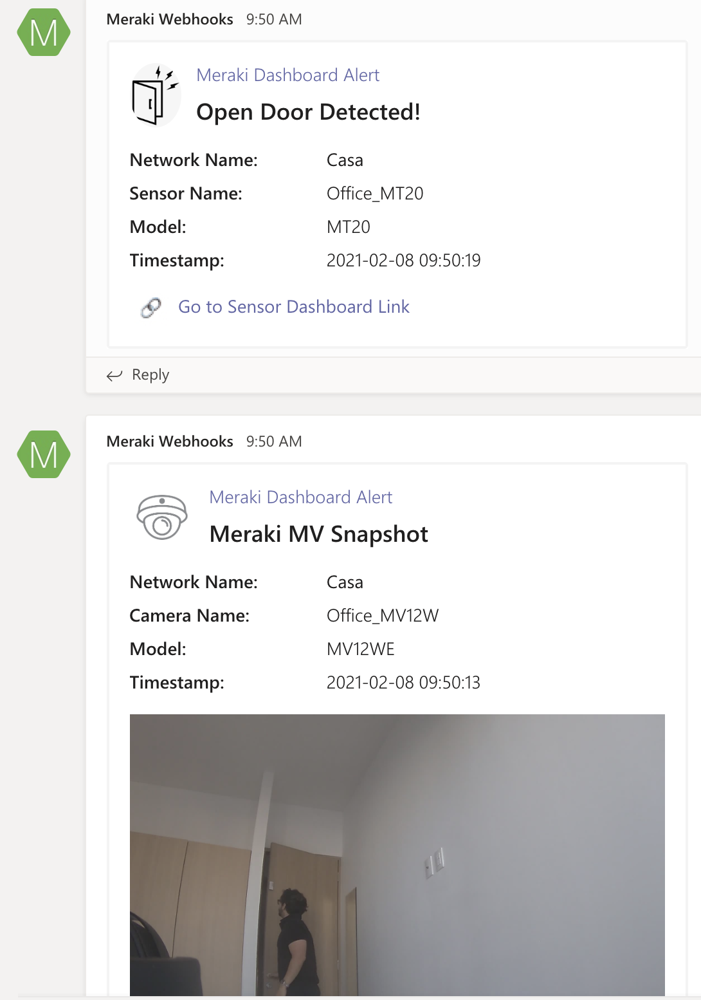

## Webex Setup

Log in to the Webex Developer [site](https://developer.webex.com/my-apps), click on your profile at the top right and select My Apps. Create a new App (or if you already have a Webex chatbot, you may reuse).

Choose Create a Bot, give it an easy to remember name and choose an icon for it and a description, and then take note of the Bot access token that appears when you hit Create Bot. This access token won’t be shown again, but you could regenerate it in the future.

## MS Teams Setup

[Sign up](https://products.office.com/en-us/microsoft-teams) free for an MS Teams account, or use your Microsoft account if you have one. Download the MS Teams [client application and install](https://www.microsoft.com/en-us/microsoft-teams/download-app).

Open your MS Teams Client and click on "Teams" on the left side:

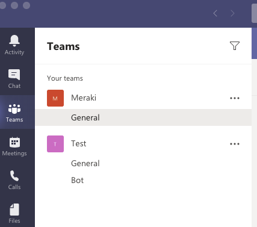

Click on Join or create a team at the bottom, choose From scratch and it can be either Public, Org-wide or Private. Once your team is created, click on Apps at the bottom left, and search for Incoming Webhook, and add the Webhook to your previously created team.

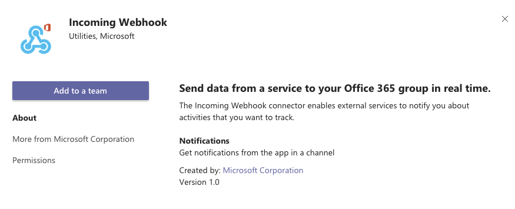

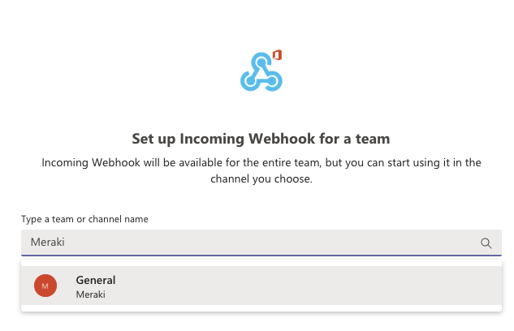

Click on Set up a Connector, and give your Webhook a Name, and optionally upload an image to it.

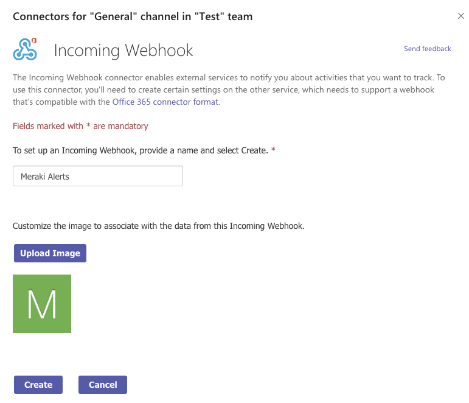

Click on Create and then take note of the Webhook URL for use later.

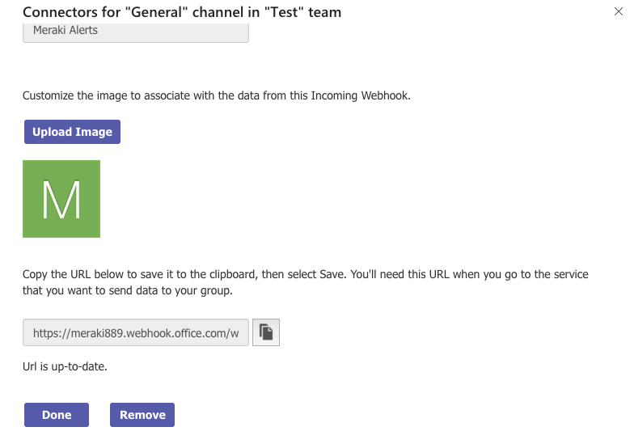

## Slack Setup

For the Slack setup, you may follow the guide [in the previous section.](#heading=h.ldq4jkskmpi7)

## Meraki Dashboard Configuration

Tag cameras to be associated with MT20s with appropriately named tags for their location and function.

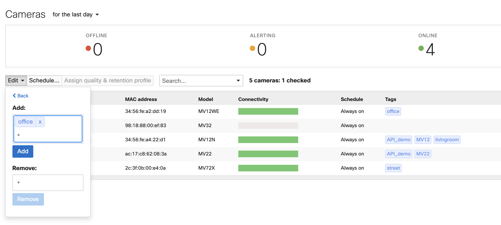

Mirror these tags on the appropriate MT20s in your deployment. For example, the camera looking at the office door with the MT20, should have the same tag as that MT20.

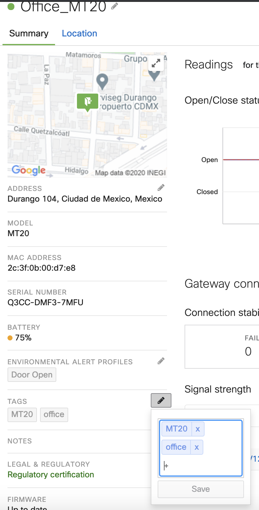

Create a new Webhook server on your Network-wide - Alerts page, pointing to the Webhooks receiver.

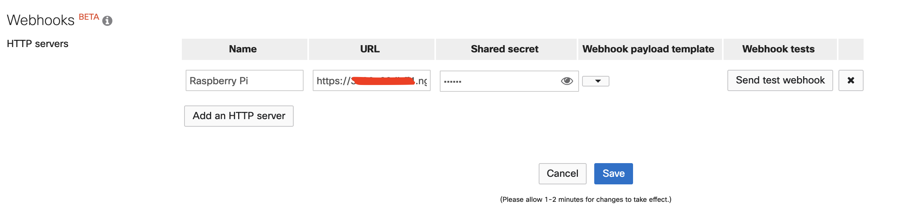

Apply a Door Open alert profile to your MT20s and add your Webhook to it.

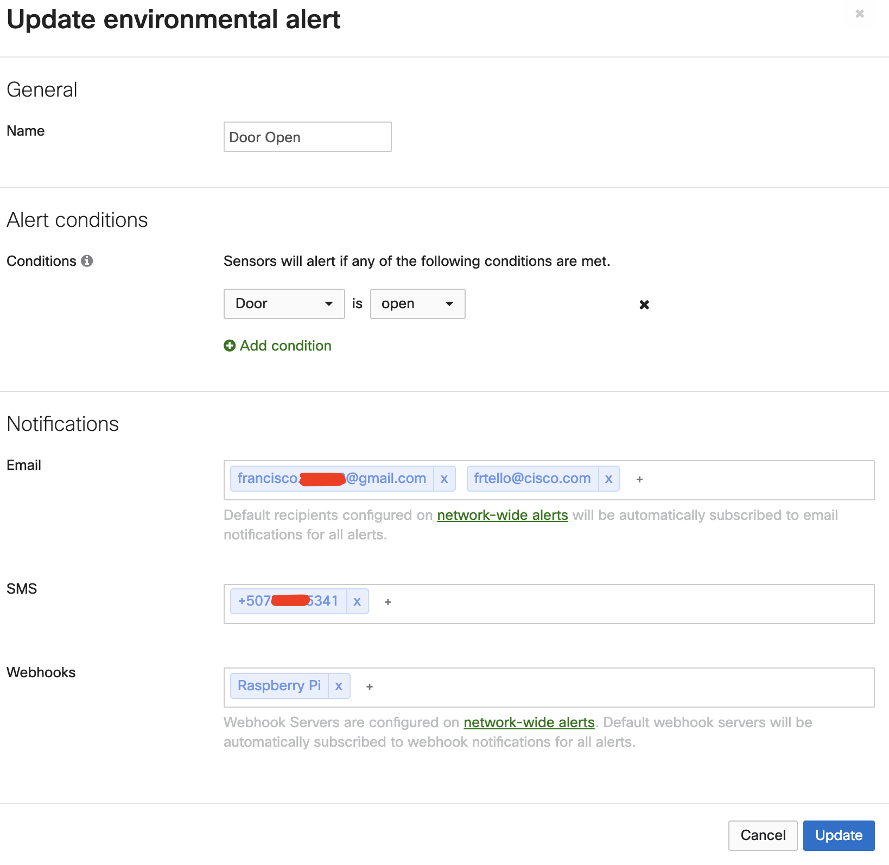

If you haven’t, generate an API Key under My Profile, and ask a Meraki SE or NSE to enable MT APIs in your organization.

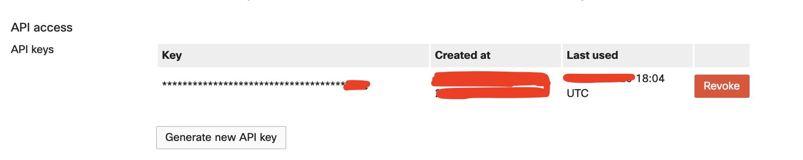

## Spinning up the server and Ngrok

In this section I will be using my Raspberry Pi 4 for setting up my Webhook receiver using a Python Flask application, but you may follow the same process for setting up the Flask application in your Mac, Windows or Linux PC, or you may modify the source code to implement in AWS Lambda, Azure Functions or Google Cloud Functions if you want a completely cloud based setup.

You will need something like a Reverse Proxy app, or a Port Forward to your server hosting the application, I chose to use a Reverse proxy.

Download a reverse proxy application, or port forward traffic to your Webhooks receiver. I use ngrok [https://ngrok.com/](https://ngrok.com/)

Download the code from the Github Repo: [https://github.com/Francisco-1088/mt-webexteams](https://github.com/Francisco-1088/mt-webexteams)

Install the dependencies in the **requirements.txt **file.

Go into the credentials.py file, and add your Meraki/Webex/MSTeams details:

* **WT_ACCESS_TOKEN: **Insert the Access Token you generated in the Webex Teams Developer Portal.

* **WT_ROOM_ID: **Insert the Room ID you have with your chatbot in Webex Teams.

* **MERAKI_API_KEY: **Insert your Meraki API Key.

* **MERAKI_ORG_ID: **Insert your Meraki Org ID.

* **MERAKI_NET_ID: **Insert your Meraki Network ID.

* **MERAKI_CAMS (OPTIONAL): **Insert the S/N of your cameras.

* **MERAKI_BASEURL: **Insert the API baseurl you’re using. Normally, **https://api.meraki.com/api/v1**

* **MS_TEAMS_URL (OPTIONAL): **Insert your MS Teams Webhook URL

* **SLACK_URL (OPTIONAL): **Insert your Slack Webhook URL

* **DOOR_TIMER (OPTIONAL): **Set the amount of time you want for time based alerting in terms of seconds. Set to 0 if you do not want time based alerting.

Start your ngrok server, and copy the https link:

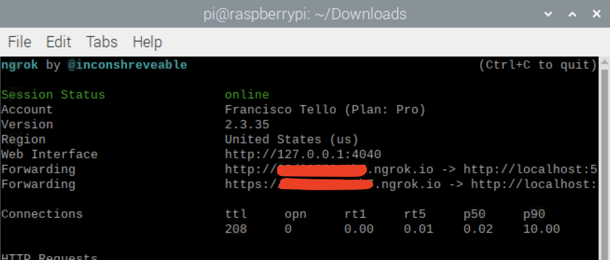

Run the receiver.py file with **python receiver.py -s ****_secret_****.**

Go to your Meraki Dashboard Network with your MTs and go to Network-Wide - Alerts - Webhooks. Configure a new Webhook and paste the HTTPS Link from ngrok here.

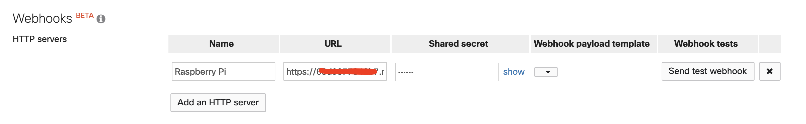

If you hit Send Test Webhook, your Python console should display something like this:

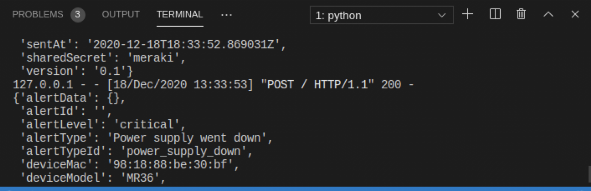

From this, you know your receiver is working, and you need to start generating sensor alerts.

# Webex, MS Teams and Slack Alerts for doors left open for a set amount of time

If you wish to receive alerts for doors that remain open for too long, you need to set up the variable DOOR_TIMER in the **credentials.py** file. If this value is set to 0, the code will skip over this section. Try not to set too large a value, because this means your web server needs to keep the thread running for this amount of time.

You will start receiving alerts like this one if you leave your door open for too long.

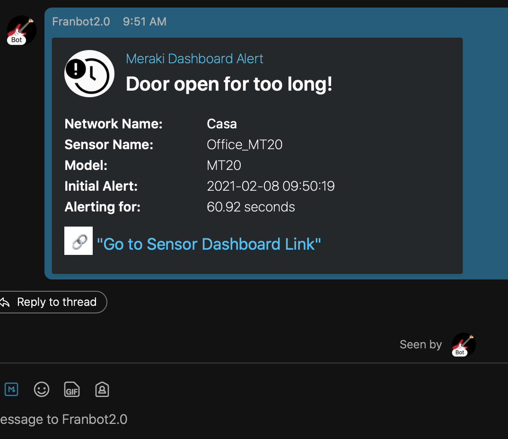

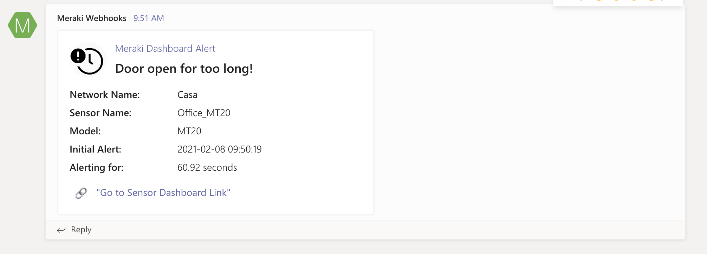

# Webex, MS Teams and Slack Alerts with Composite Camera images

It’s also possible to receive composite images in your alerts if you’ve set up the Motion Recap functionality as in part I. This part of the code will wait to receive a Motion detected alert, and then the code proceeds to verify the status of the door sensor associated with the camera that sent the alert (via the Tags you set before). If the door status is open, then the Image URL will be downloaded, and a new image will be crafted like the ones below.

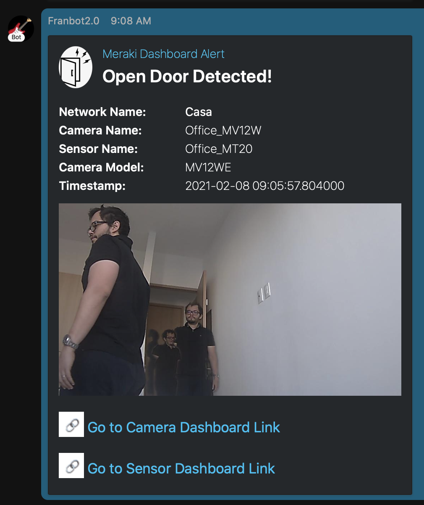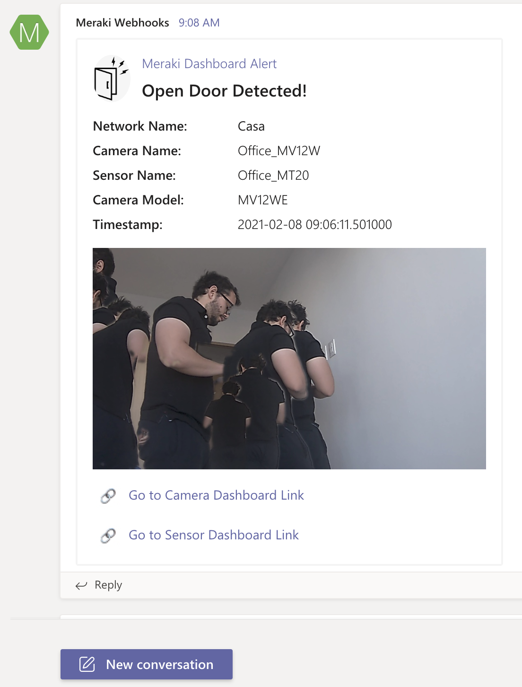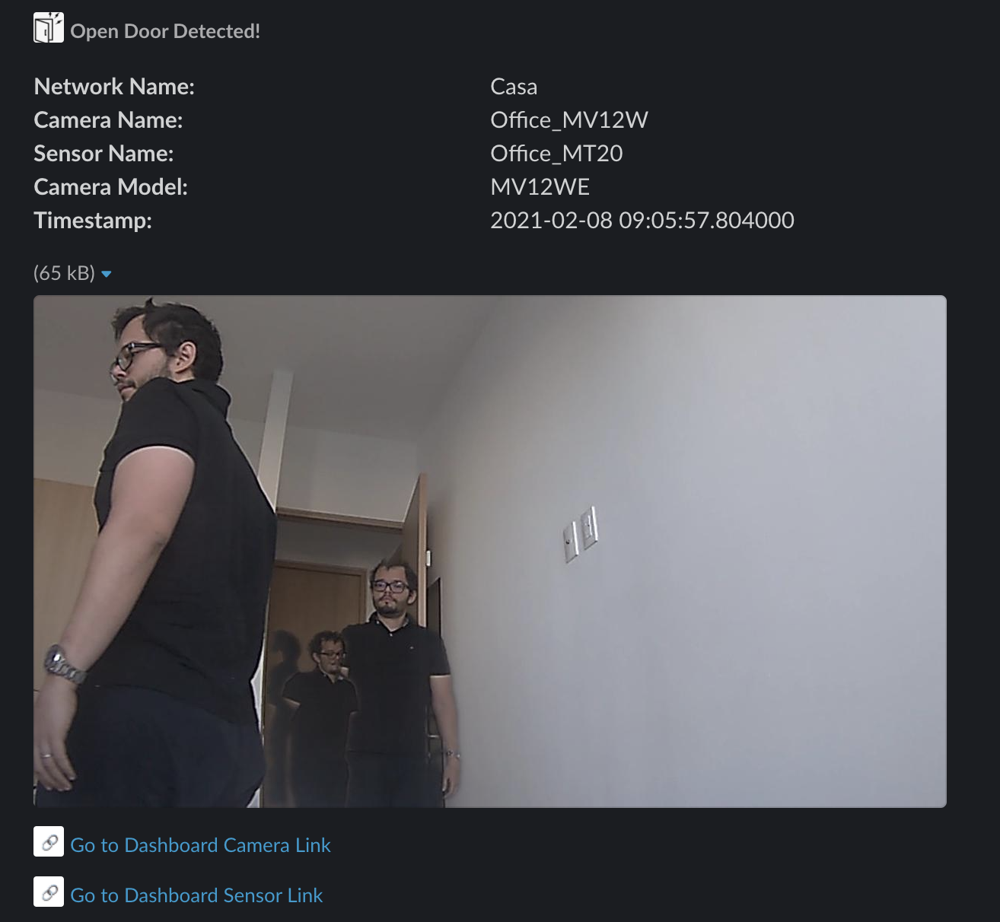

# Appendix: Adaptive Cards for Webex and MS Teams and Message Blocks for Slack

In the previous sections, for Webex and MS Teams you’ve been sending messages to these clients using a specialized format which is called Adaptive Card. This is a specification created by Microsoft, but which is compatible across several messaging platforms. This allows the creation of interactive messages and very visually appealing notifications. You may have seen them before in the Meraki Demo API Platform.

If you want to customize your cards to say something different or display different images, you may do so tweaking the **adaptive_cards.py** file, where a function has been created for each type of Adaptive Card (Door Open, Snapshot, Door Open for too Long and Motion Recap).

If you want to experiment with creating your own adaptive cards from scratch, you may use the following tools as guidance:

* [Buttons and Cards](https://developer.webex.com/docs/api/guides/cards)

* [Buttons and Cards Designer](https://developer.webex.com/buttons-and-cards-designer)

In the case of Slack, Slack does not support the Adaptive Card specification, but it does allow specialized formatting of their messages. The format is also JSON based like Adaptive Cards, and it’s very similar. If you want to experiment with crafting your own Slack messages, you may use the following tools as guidance:

* [Creating rich message layouts](https://api.slack.com/messaging/composing/layouts#attachments)

* [Block Kit designer](https://api.slack.com/block-kit)

